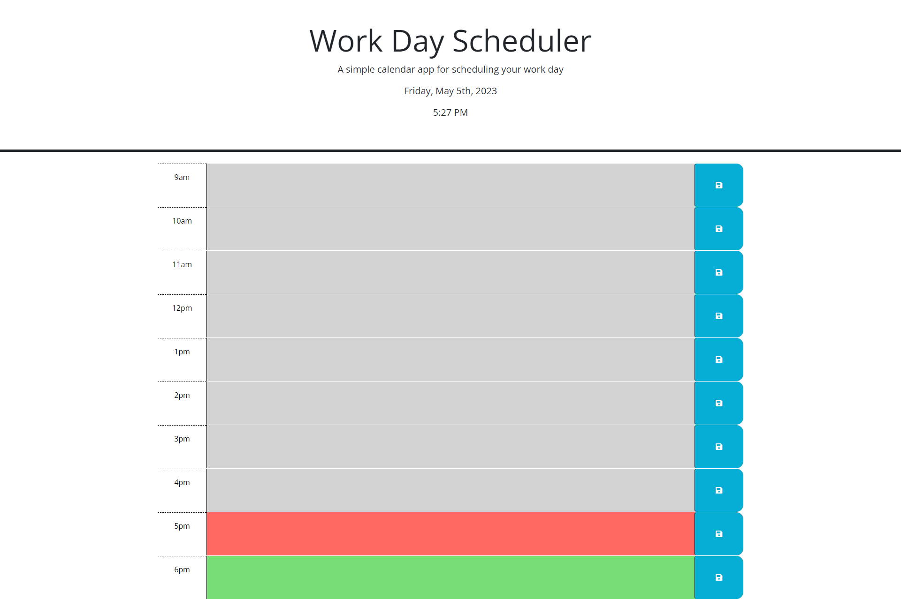

# Day Calendar

## Description
A simple calendar application that allows a user to save events for each hour of the day. 

## Table of Contents
- [Installation](#installation)
- [Usage](#usage)
- [License](#license)
- [Contributing](#contributing)
- [Testing](#testing)
- [Questions](#questions)

## Installation
Simply run <a href="https://jako0320.github.io/JS-DayCalendar/">this link</a> in any browser.

## Usage

## License

  
This application is not covered under any license. 

## Contributing
Please use as you see fit, here is the <a href="https://github.com/Jako0320/JS-DayCalendar">GitHub repo</a>.

## Testing
N/A

## Questions
Please feel free to reach out for any questions:
- GitHub: https://github.com/jako0320
- Email: jacques.scoffoni@gmail.com
